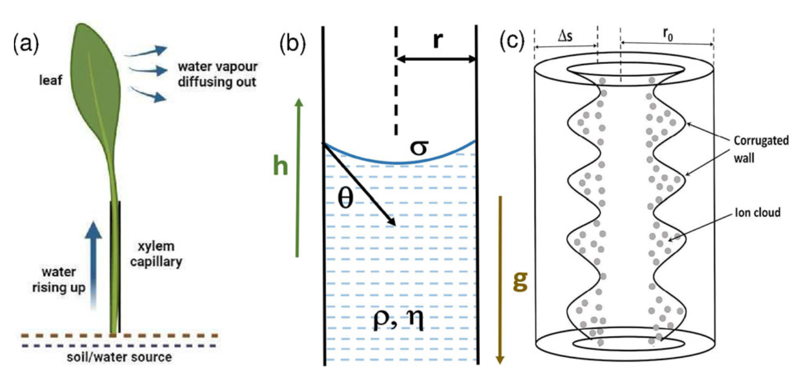
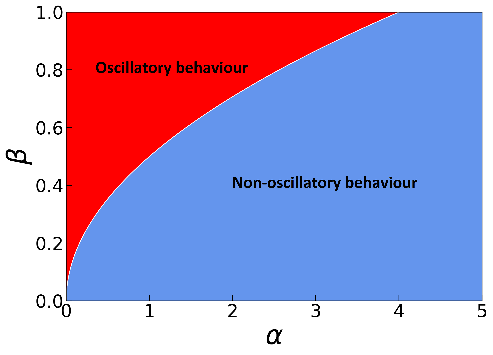
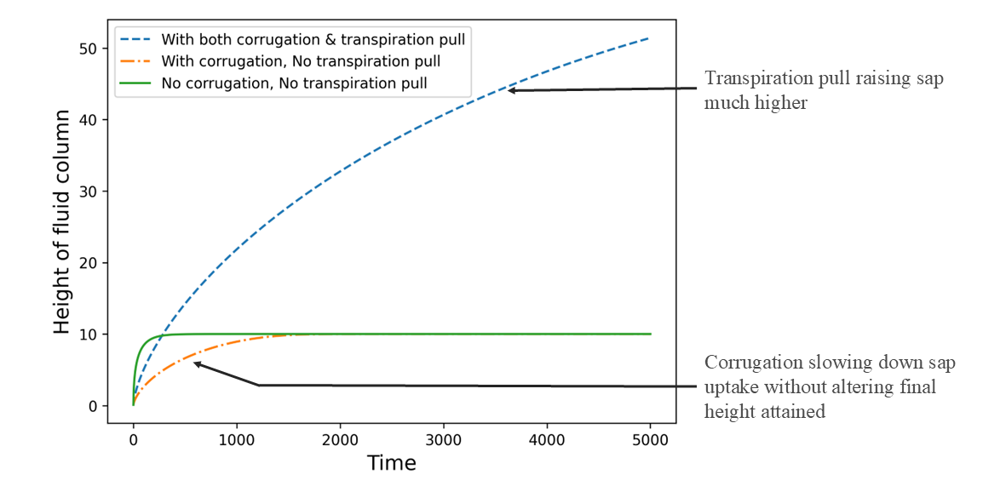

# Xylem Sap Ascent: Effects of Conduit Friction and Charged Species

This repository provides a computational companion to the paper:

**Effect of conduit friction and presence of charged species on rise of xylem sap** (Eur. Phys. J. E (2026) 49:6)
https://doi.org/10.1140/epje/s10189-025-00543-x 

**Authors:**  Riddhika Mahalanabis and Balakrishnan Ashok

---

## Scientific Context

Water transport in plants occurs through the xylem, where sap ascent is governed by a combination of capillary forces, viscous dissipation, and interactions at the conduit walls.

This work investigates how:

* **conduit friction** modifies the effective resistance to flow, and
* the presence of **charged species in the sap** alters interfacial energetics

together influencing the height and dynamics of sap ascent.

The study provides a physically motivated framework to understand deviations from classical capillary rise models in biologically relevant systems.

  

---

## What This Repository Contains

This repository is designed to illustrate and reproduce key physical insights from the paper using minimal computational models.

It includes:

* Implementation of the governing equations for sap ascent
* Exploration of parameter dependence (friction, charge effects)
* Reproduction of representative results from the study

---

## Key Results

### Effect of Conduit Friction

Friction introduces additional resistance to flow, reducing the effective rise height and modifying the transient dynamics.

  

---

### Combined Effects

The interplay between viscous dissipation and interfacial modifications leads to nontrivial deviations from classical predictions.

  

---
### Effect of transpiration pull

  

---

### Overview

  

##  Notebooks

The repository is organized into a small set of notebooks, each focusing on a specific aspect of the physics:

* `1_basic_model.ipynb`
  Introduces the governing equations and baseline capillary rise behavior.

* `2_effect_of_friction.ipynb`
  Explores how conduit friction alters the dynamics and steady-state height.

* `3_reproduce_key_figures.ipynb`
  Reproduces representative results from the paper.

---

## How to Use

1. Open any notebook in Google Colab or Jupyter
2. Run all cells to reproduce the results
3. Modify parameters to explore different physical regimes

---

## Interpretation

The results highlight that xylem sap ascent cannot always be captured by classical capillary rise alone.

* **Friction** introduces dissipative corrections that slow down and limit ascent
* **Charged species** modify interfacial energy and effective driving forces
* Their **combined effect** leads to quantitatively and qualitatively different behavior

These findings are relevant for understanding water transport in realistic plant conduits, where both effects are expected to coexist.

---

## Notes

* The code is intentionally kept minimal and transparent
* The goal is to provide a conceptual and reproducible view of the model
* For full theoretical details, please refer to the published paper

---

## Citation

If you use this work, please cite:

*Effect of conduit friction and presence of charged species on rise of xylem sap*
Eur. Phys. J. E (2026) 49:6

[DOI : 10.1140/epje/s10189-025-00543-x](https://doi.org/10.1140/epje/s10189-025-00543-x)

@article{mahalanabis2026effect,
  title={Effect of conduit friction and presence of charged species on rise of xylem sap},
  author={Mahalanabis, Riddhika and Ashok, Balakrishnan},
  journal={The European Physical Journal E},
  volume={49},
  number={1},
  pages={6},
  year={2026},
  publisher={Springer}
}

